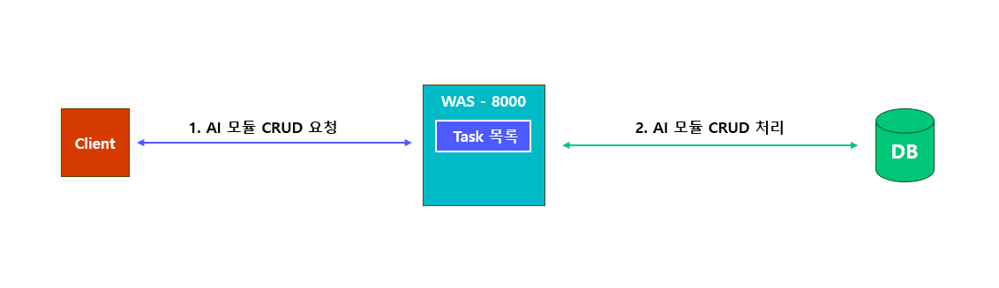
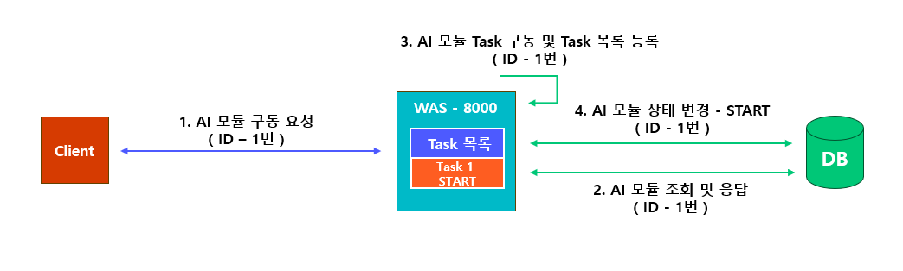
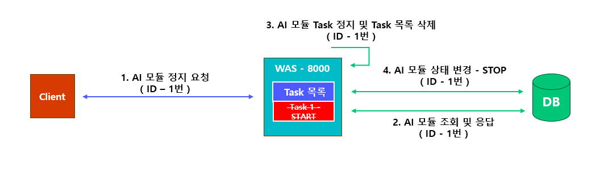
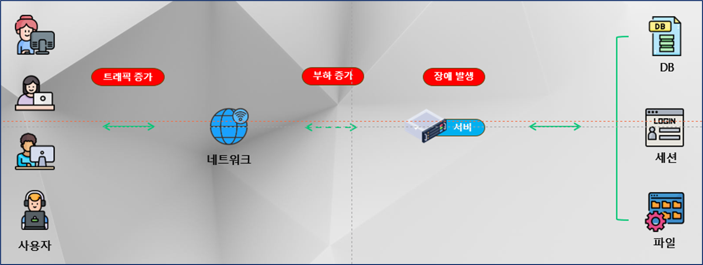
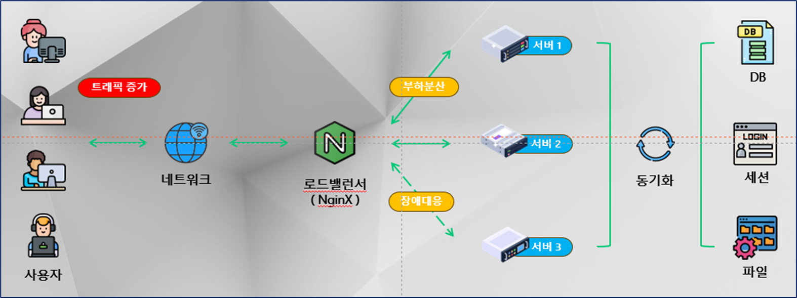
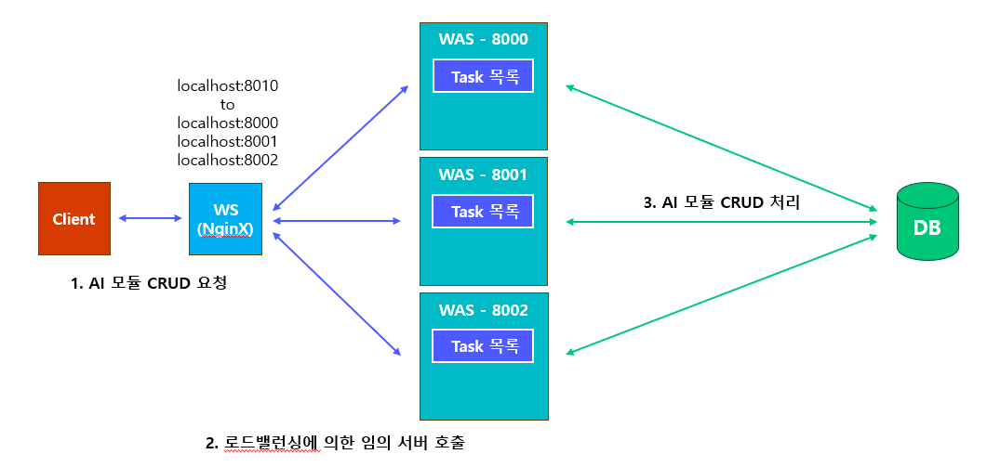
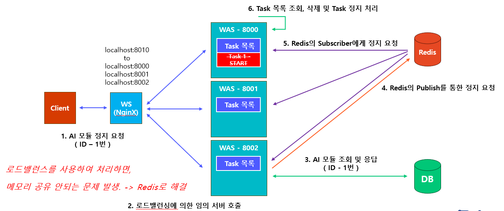
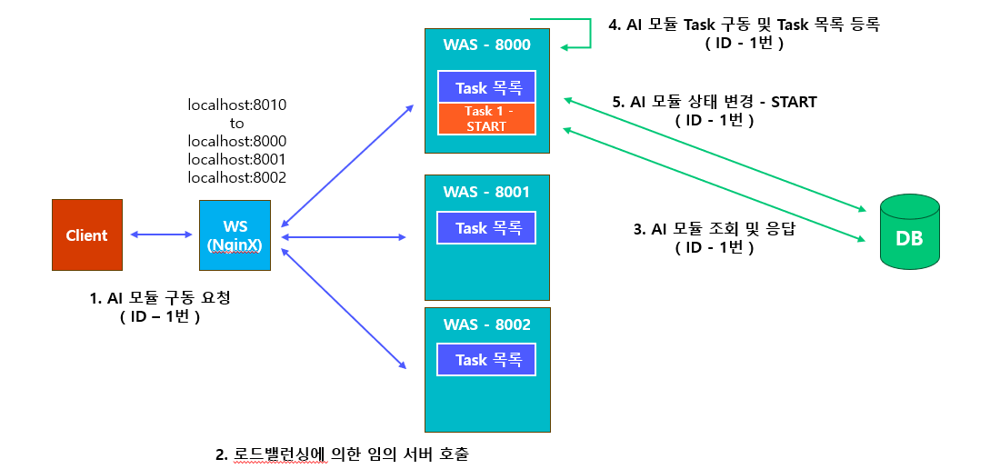

# 1. AI 모듈 실습 1 (DB 사용 X)
## 1-1. 프로그램 설치
* Pycharm 설치
  * 다운로드: https://www.jetbrains.com/ko-kr/pycharm/


* Anaconda 설치
  * 다운로드: https://www.anaconda.com/download/success
  * VSCode 환경 접속: conda activate [환경 명칭]


* Postman 설치
  * 다운로드: https://www.postman.com/downloads/


* 패키지 설치
  * uvicorn, fastapi, jinja2

## 1-2. main_local 프로그램 구조
### 1) AI 모듈 CRUD

### 2) AI 모듈 구동

### 3) AI 모듈 정지


## 1-3. main_local.py 실습

# 2. NginX 실습
## 2-1. 로드밸런스


## 2-2. 프로그램 설치

* NginX 설치
  * 다운로드: https://nginx.org/en/download.html
  * 실행: nginx-1.27.4 폴더 -> 상단 경로 클릭 -> cmd 입력 -> nginx 입력 및 실행
  * 중지: nginx-1.27.4 폴더 -> 상단 경로 클릭 -> cmd 입력 -> nginx -s stop 입력 및 실행
  * 설정: 
    * my_config 폴더 생성 -> 마우스 우클릭 -> 새로 만들기 -> 텍스트 문서 -> 새 텍스트 문서.txt 를 config.conf 로 변경
    * config.conf 우클릭 -> 메모장에서 편집 -> 아래 내용 입력 및 저장
    ```
      upstream my_server {
        least_conn;
        server localhost:8000;
        server localhost:8001;
        server localhost:8002;
      }

      server {
        listen 8010;
        server_name localhost;
  
        location / {
          proxy_pass http://my_server;
          
          proxy_set_header X-Real-IP $remote_addr;
          proxy_set_header X-Real-Port $remote_port;
          proxy_set_header X-Forwarded-For $proxy_add_x_forwarded_for;
          proxy_set_header Host $http_host;
          proxy_set_header X-NginX-Proxy true;

          # 타임아웃 설정 추가
          proxy_connect_timeout 300;
          proxy_send_timeout 300;
          proxy_read_timeout 300;
          
          # 버퍼 크기 설정
          proxy_buffer_size 128k;
          proxy_buffers 4 256k;
          proxy_busy_buffers_size 256k;
          
          # 프록시 응답 버퍼링 활성화
          proxy_buffering on;
      }
    }
    ```
    * nginx-1.27.4 -> conf 폴더 이동 -> nginx.conf 우클릭 -> 메모장에서 편집 -> 맨 하단 } 윗줄에 다음 추가
    ```
    include ../my_config/config.conf;
    ```
    
## 2-3. 로드밸런스 구조



## 2-4. 로드밸런스 적용 실습

## 2-5. 기존 프로젝트의 문제점
### 1) 서버가 3개로 늘어나서, 서버의 Task를 관리하는 리스트를 공유할 수 없음
### 2) 공유되지 않은 변수로 인하여, AI 모듈 구동/중단 API 요청이 정상적으로 처리되지 않음
### 3) 동일한 AI 모듈이 각 서버에서 중복적으로 구동/중단 문제 발생

## 2-5. 해결 방법
### 1) Redis를 이용하여 중앙에서 통제하는 방법
### 2) Task를 관리하는 중앙 서버를 추가하는 방법


# 3. AI 모듈 실습 3 (PostgreSQL, Redis 사용)
## 3-1. 프로그램 설치

* DockerHub 설치
  * 다운로드: https://www.docker.com/products/docker-desktop/


* PostgreSQL 설치
  * 방법 1: Postgres 직접 설치
    * 다운로드: https://www.enterprisedb.com/downloads/postgres-postgresql-downloads -> Windows x86-64 선택
  * 방법 2: 도커 허브를 통해 설치
    * 다운로드: https://www.docker.com/products/docker-hub/
    * 이미지 다운로드: 도커 허브에서 postgres:latest 검색 및 이미지 pull
    * 컨테이너 생성 및 실행:
    ```
    docker run -d --name local_postgresql -e POSTGRES_USER=postgres -e POSTGRES_PASSWORD=0000 -p 5432:5432 postgres:latest
    ```
    

* PGAdmin 설치
  * 다운로드: https://www.postgresql.org/ftp/pgadmin/pgadmin4/v9.1/windows/


* Redis 설치
  * 방법: 도커 허브를 통해 설치
  * 이미지 다운로드: 도커 허브에서 redis:latest 검색 및 이미지 pull
  * 컨테이너 생성 및 실행:
  ```
  docker run -d --name local_redis -p 6379:6379 redis:latest
  ```

* 패키지 설치
  * redis-py, sqlalchemy, asyncpg

## 3-2. main_redis 프로그램 구조
### 1) AI 모듈 CRUD


### 2) AI 모듈 구동


### 3) AI 모듈 정지


## 3-3. main_redis.py 실습

# 4. JMeter 실습
## 4-1. 프로그램 설치

* OpenJDK 17 
  * 다운로드: https://jdk.java.net/java-se-ri/17-MR1
  * 설치:
    * 다운로드 및 압축해제
    * C:\ 경로로 폴더 복사
    * C:\jdk-xxx\bin 이동 및 경로 복사
    * 윈도우 검색 -> 시스템 환경 변수 편집 -> 고급 -> 환경변수 
    * -> 시스템 변수 -> 편집 -> 새로 만들기 -> 복사한 경로 붙여넣기 -> 확인
  * 설치 확인:
    * 윈도우 검색 -> cmd 입력 및 실행 -> java --version 입력 및 버전 확인


* JMETER: 5.1.1
  * 다운로드: https://archive.apache.org/dist/jmeter/binaries/
  * 실행: apache-jmeter-5.1.1/bin -> jmeter.bat 실행


* NGINX: 1.27.4
  * 다운로드: https://nginx.org/en/download.html
  * 실행: nginx-1.27.4 -> 상단 경로 클릭 -> cmd 입력 -> nginx 입력 및 실행
  * 중지: nginx -s stop
  * 설정: 
    * my_config 폴더 생성 -> 마우스 우클릭 -> 새로 만들기 -> 텍스트 문서 -> 새 텍스트 문서.txt 를 config.conf 로 변경
    * config.conf 우클릭 -> 메모장에서 편집 -> 아래 내용 입력 및 저장
    ```
      upstream my_server {
        least_conn;
        server localhost:8001;
        server localhost:8002;
        server localhost:8003;
      }

      server {
        listen 8010;
        server_name localhost;
  
        location / {
          proxy_pass http://my_server;
          
          proxy_set_header X-Real-IP $remote_addr;
          proxy_set_header X-Real-Port $remote_port;
          proxy_set_header X-Forwarded-For $proxy_add_x_forwarded_for;
          proxy_set_header Host $http_host;
          proxy_set_header X-NginX-Proxy true;

          # 타임아웃 설정 추가
          proxy_connect_timeout 300;
          proxy_send_timeout 300;
          proxy_read_timeout 300;
          
          # 버퍼 크기 설정
          proxy_buffer_size 128k;
          proxy_buffers 4 256k;
          proxy_busy_buffers_size 256k;
          
          # 프록시 응답 버퍼링 활성화
          proxy_buffering on;
      }
    }
    ```
    * nginx-1.27.4 -> conf 폴더 이동 -> nginx.conf 우클릭 -> 메모장에서 편집 -> 맨 하단 } 윗줄에 다음 추가
    ```
    include ../my_config/config.conf;
    ```

# 5. PM2, 도커 스웜
## 5-1. 참고
### PM2와 도커 스웜은 실습 생략

## 5-2. 프로그램 설치

* PM2 (실습X)
  * NodeJS 설치: https://nodejs.org/ko/download
  * PM2 설치: cmd -> npm i pm2 -g
  * 등록 및 구동: 
    * pm2 start main.py --interpreter python
    * pm2 start main1.py --interpreter python
    * pm2 start main2.py --interpreter python
  * 정지: pm2 stop all 또는 pm2 stop <ID 또는 앱 이름>
  * 삭제: pm2 delete all 또는 pm2 stop <ID 또는 앱 이름>
  * 목록 확인: pm2 list
  * 로그 확인: pm2 logs 또는 pm2 logs <ID 또는 앱 이름>
  * PM2 모니터링: pm2 monit
  * PC 재부팅 시 자동 시작
    * pm2 startup -> 권한 오류 발생하면 복사후 입력 및 엔터
    * pm2 save
  * 참고
    * PM2에서 파이썬 프로그램이 cluster 모드로 정상 작동하지 않는 문제가 있음


* 도커 스웜을 이용한 로드밸런스
  * 준비
    * 현재 디렉토리 이동 및 CMD 실행 
    * Dockerfile 준비
    ```
    FROM python:3.8-slim
    
    WORKDIR /app
    
    COPY requirements.txt .
    RUN pip install --upgrade pip
    RUN pip install -r requirements.txt
    
    COPY . .
    ```
    * requirements.txt 준비
    ```
    annotated-types==0.6.0
    anyio==4.2.0
    async-timeout==4.0.3
    asyncpg==0.29.0
    click==8.1.7
    colorama==0.4.6
    exceptiongroup==1.2.0
    fastapi==0.112.2
    greenlet==3.0.1
    h11==0.14.0
    idna==3.7
    jinja2==3.1.4
    markupsafe==2.1.3
    pip==24.2
    pydantic==2.8.2
    pydantic-core==2.20.1
    setuptools==75.1.0
    sniffio==1.3.0
    sqlalchemy==1.4.51
    starlette==0.38.2
    typing-extensions==4.11.0
    uvicorn==0.20.0
    wheel==0.44.0
    redis==3.5.3
    ```
  * util/database.py의 DB_URL의 IP 변경
    * DB_URL = 'postgresql+asyncpg://postgres:0000@<Postgres 도커 스웜 서비스 명=postgres_service>:5432/postgres'
  * 이미지 빌드
    * docker build -t hanbat:latest .
  * 도커 스웜 초기화
    * docker swarm init --advertise-addr 127.0.0.1
  * 도커 스웜 네트워크 그룹 생성
    * docker network create -d overlay --opt com.docker.network.driver.mtu=1450 hanbat_network
  * 도커 스웜 네트워크 조회
    * docker network ls 
  * 도커 스웜 서비스 등록
    * [docker service create --name redis_service --network hanbat_network -p 6379:6379 redis:latest] 
    * docker service create --name postgres_service --network hanbat_network -p 5432:5432 -e POSTGRES_USER=postgres -e POSTGRES_PASSWORD=0000 postgres:latest
    * docker service create --name hanbat_service --network hanbat_network -p 8000:8000 --replicas 3 hanbat:latest
  * 도커 스웜 서비스 목록 조회
    * docker service ls
  * 도커 스웜 서비스 정지
    * docker service scale hanbat_service=0 또는 docker service update --replicas=0 hanbat_service
  * 도커 스웜 서비스 삭제
    * docker service rm hanbat_service
  * 참고
    * 특정 이미지의 컨테이너 삭제
    * docker rm $(docker ps -a --filter ancestor=<이미지명>:<태그>)


컨테이너 IP 확인: docker inspect 46c5
docker run -d --name local_postgresql -e POSTGRES_USER=postgres -e POSTGRES_PASSWORD=0000 -p 5432:5432 postgres:latest
docker run -d --name local_redis -p 6379:6379 redis:latest
docker run -d --name local_hanbat -p 8000:8000 hanbat:latest

# 6. 참고

## 6-1. 참고 사이트
  * TIOBE: 인기언어 지표 순위 사이트
    * https://www.tiobe.com/tiobe-index/
  * TechEmpower: 웹 프레임워크 비교 순위 사이트
    * https://www.techempower.com/benchmarks
  * 요즘 IT: 쉽게 재미있게 읽을 수 있는 IT 관련 매거진
    * https://yozm.wishket.com/magazine/
  * TheMiilk: 실리콘밸리의 최신 AI 뉴스
    * https://www.themiilk.com/
  * 인프런: 무료, 유료 온라인 강의 사이트
    * https://www.inflearn.com/
  * 렛플: 사이드 프로젝트 관련 사이트
    * https://letspl.me/
  * 홀라월드: 사이드 프로젝트 관련 사이트
    * https://holaworld.io/

## 6-2. 참고 프로그램
  * Pigma: 디자인 및 프로그램 포트폴리오 작성 도구
    * https://www.figma.com/ko-kr/
  * Mermaid: 다이어그램 및 차트 작성 도구
    * https://mermaid.js.org/
  * DBDiagram: DB ERD 작성 및 테이블 생성 도구 (무료. 커맨드를 이용)
    * https://dbdiagram.io/home
  * eXERD: DB ERD 작성 도구 (30일 무료, 쉬운 사용)
    * https://www.exerd.com/index.do
  * PyCharm: 파이썬 에디터 (유료. 다양한 편의 기능. 대학 이메일 계정 연동시 1년 무료 및 연장)
    * https://www.jetbrains.com/ko-kr/pycharm
  * JIRA: 프로젝트 이슈 및 일정 관리도구
    * https://www.atlassian.com/ko/software/jira
